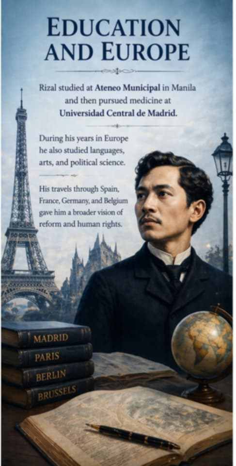
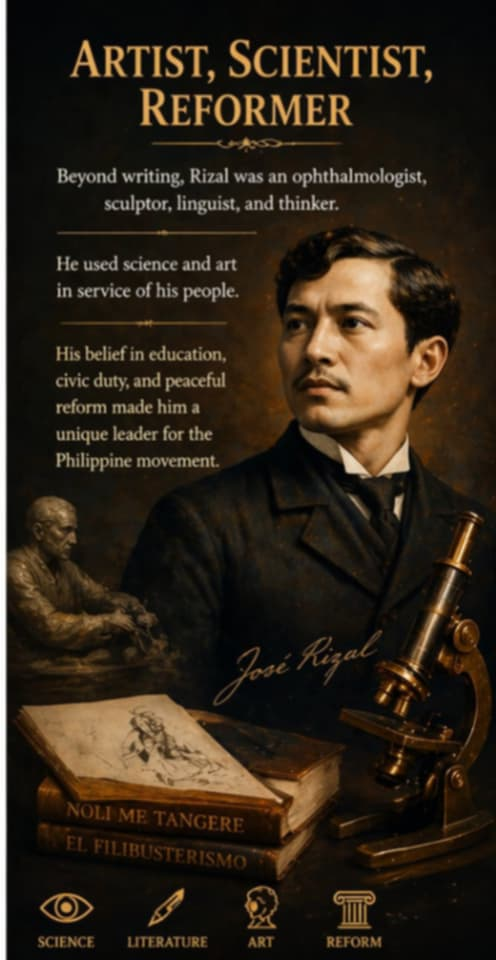
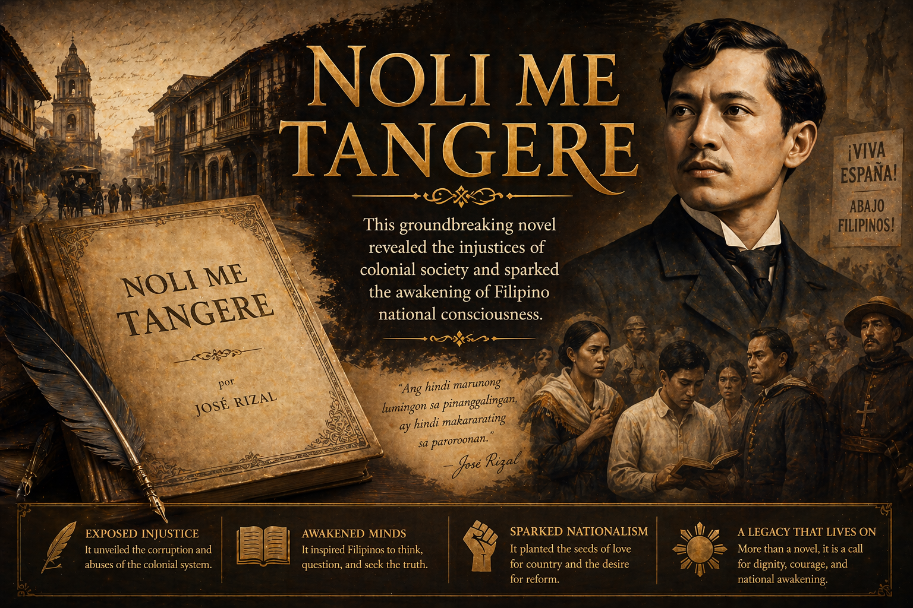
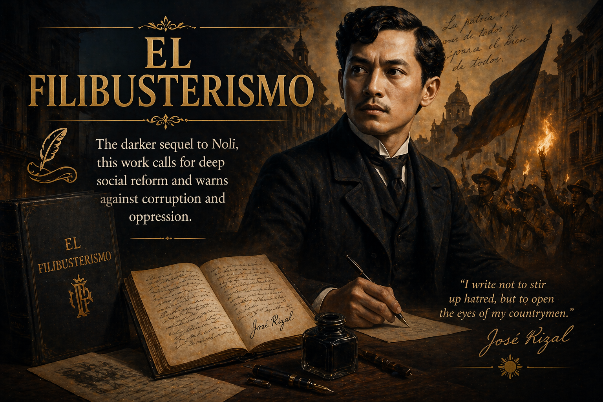
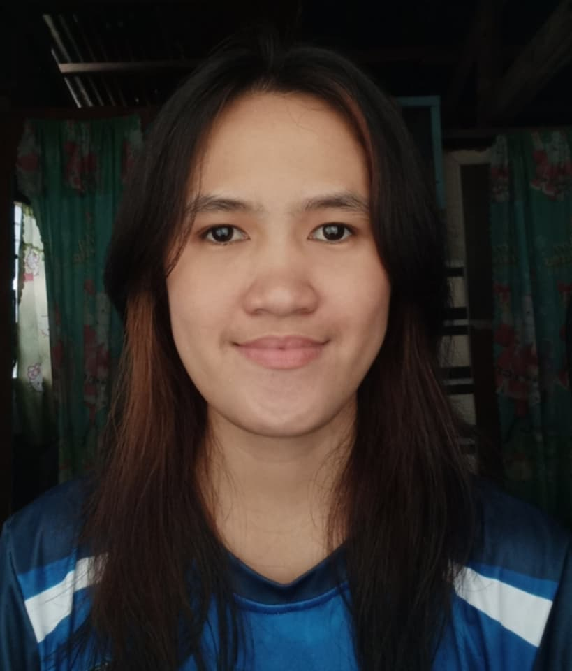
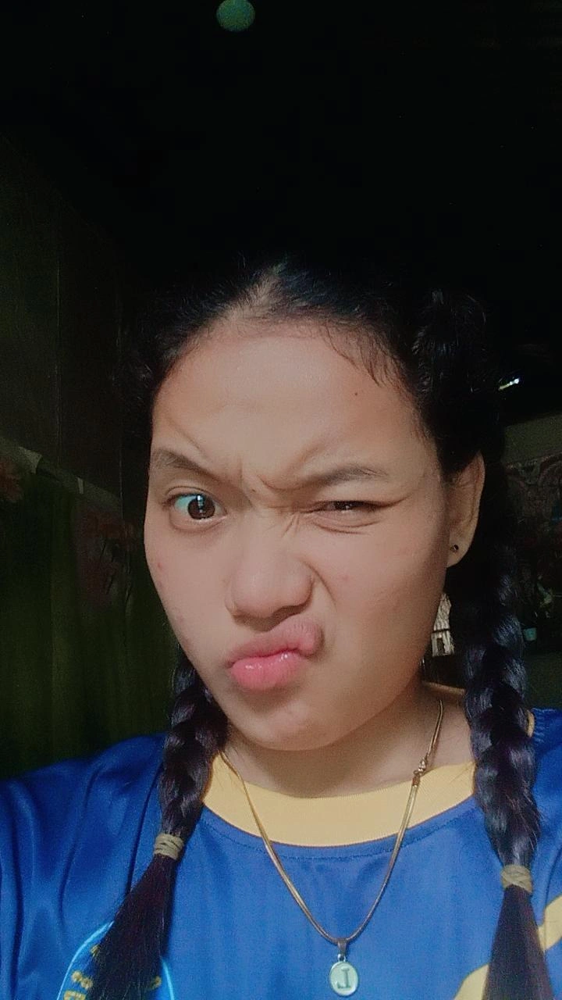
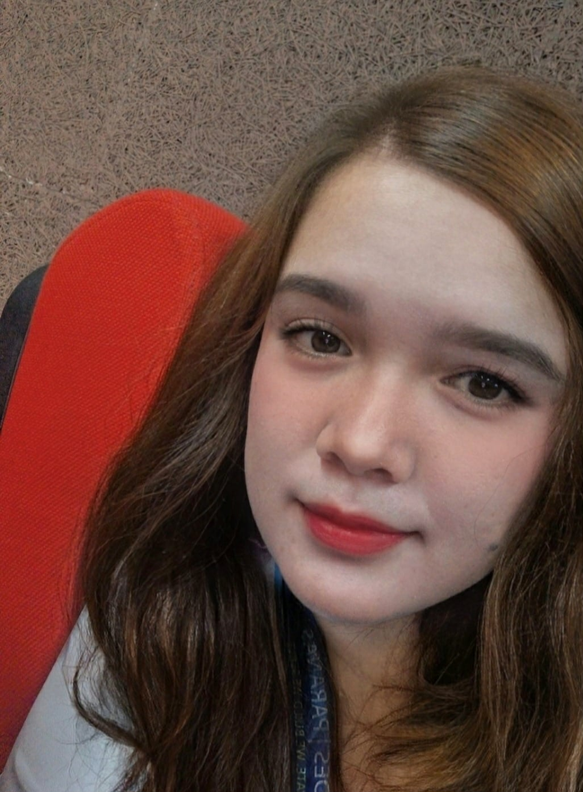
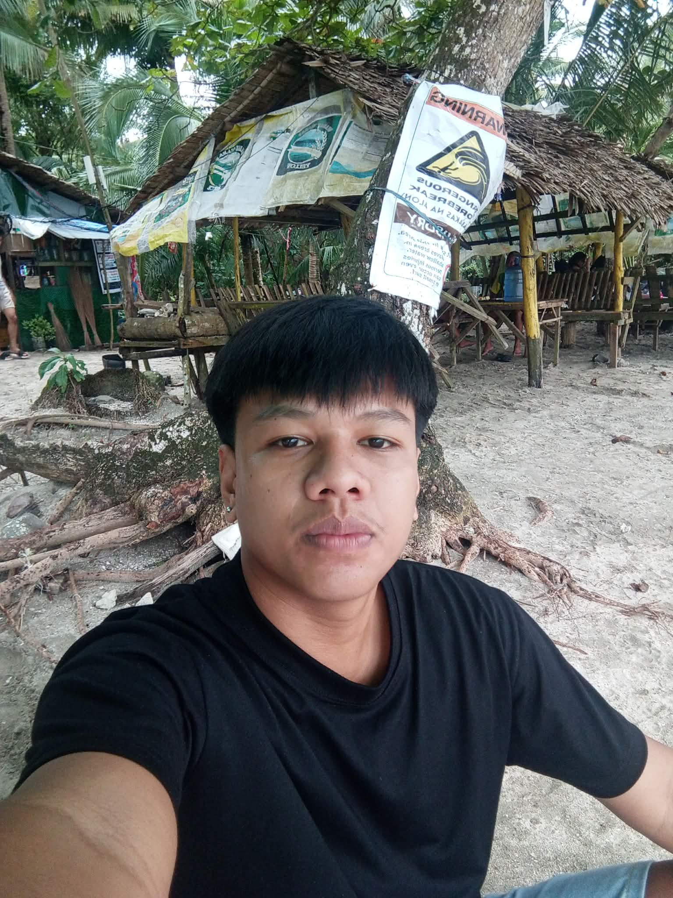
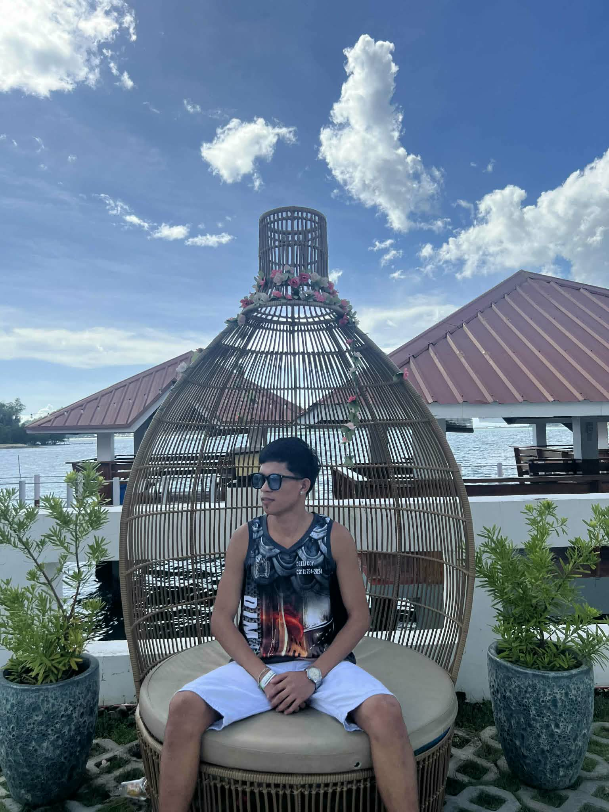

<!DOCTYPE html>
<html lang="en">
<head>
<meta charset="UTF-8">
<meta name="viewport" content="width=device-width, initial-scale=1.0">
<title>José Rizal | Bayaning Pilipino</title>

<link href="https://fonts.googleapis.com/css2?family=Playfair+Display:wght@600;700&family=Poppins:wght@300;400;500;600&display=swap" rel="stylesheet">

</head>
<body>
<header id="home">
    

        <nav class="navbar">
            
José Rizal

            <button class="menu-toggle" aria-label="Toggle navigation" type="button">
                
                
                
            </button>
            

                <a href="#home" class="active">Home</a>
                <a href="#about">About</a>
                <a href="#impact">Impact</a>
                <a href="#works">Works</a>
                <a href="#timeline">Timeline</a>
                <a href="#quotes">Quotes</a>
                <a href="#members">Members</a>
                <a href="#legacy">Legacy</a>
                <a href="#course">Course</a>
            

        </nav>
        

            

                
National Hero of the Philippines

                <h1>José Rizal: Writer, Doctor, Reformer</h1>
                
From a quiet town in Laguna to the great capitals of Europe, José Rizal carried the hopes of a nation. His words, ideas and peaceful courage continue to inspire Filipino pride and unity.

                

                    <a href="#about" class="btn btn-primary">Discover His Story</a>
                    <a href="#works" class="btn btn-secondary">Explore His Works</a>
                

            

        

    

</header>
<main class="container">
    <section id="about" class="section">
        <h2>About José Rizal</h2>
        

            <a class="card card-link" href="early-life.html">
                
                <h3>Early Life</h3>
                
José Protacio Rizal Mercado y Alonzo Realonda was born on June 19, 1861 in Calamba, Laguna. He was the seventh of eleven children and grew up in a family that valued education, language, and national pride.

                
His parents, Francisco and Teodora, nurtured his talent and taught him that learning and discipline could empower his people.

            </a>
            <a class="card card-link" href="education.html">
                
                <h3>Education and Europe</h3>
                
Rizal studied at Ateneo Municipal in Manila and then pursued medicine at Universidad Central de Madrid. During his years in Europe he also studied languages, arts, and political science.

                
His travels through Spain, France, Germany, and Belgium gave him a broader vision of reform and human rights.

            </a>
            <a class="card card-link" href="artist.html">
                
                <h3>Artist, Scientist, Reformer</h3>
                
Beyond writing, Rizal was an ophthalmologist, sculptor, linguist, and thinker. He used science and art in service of his people.

                
His belief in education, civic duty, and peaceful reform made him a unique leader for the Philippine movement.

            </a>
        

    </section>
    <section id="impact" class="section">
        <h2>Impact and Influence</h2>
        

            <a class="card card-link" href="voice.html">
                
                <h3>Voice of Reform</h3>
                
Rizal’s writings exposed the abuses of colonial authorities and encouraged Filipinos to seek justice and equal rights.

                
His novels and essays helped persuade many to support peaceful reform rather than violent revolution.

            </a>
            <a class="card card-link" href="national.html">
                
                <h3>National Identity</h3>
                
Rizal inspired a sense of Filipino identity, dignity, and independence. He reminded his countrymen that true freedom begins with knowledge and self-respect.

                
His life continues to remind Filipinos that character, courage, and ideas can change history.

            </a>
        

    </section>
    <section id="works" class="section">
        <h2>Major Works</h2>
        

            <a class="card card-link" href="noli.html">
                
                <h3>Noli Me Tangere</h3>
                
This groundbreaking novel revealed the injustices of colonial society and sparked the awakening of Filipino national consciousness.

            </a>
            <a class="card card-link" href="el-filibusterismo.html">
                
                <h3>El Filibusterismo</h3>
                
The darker sequel to Noli, this work calls for deep social reform and warns against corruption and oppression.

            </a>
            <a class="card card-link" href="letters-essays.html">
                
                <h3>Letters and Essays</h3>
                
His letters and essays, including writings for La Solidaridad, expressed his social and political views with clarity and conviction.

            </a>
            <a class="card card-link" href="poetry-journalism.html">
                
                <h3>Poetry and Journalism</h3>
                
Rizal also wrote poetry and newspaper articles that expressed love for country, education, and the human spirit.

            </a>
        

    </section>
    <section id="timeline" class="section">
        <h2>Timeline</h2>
        

            

                <a class="course-item" href="1861-birth.html">
                    1861
                    Birth in Calamba - Born into a loving and educated family, Rizal showed early gifts in language and learning.
                </a>
                <a class="course-item" href="1872-gomburza.html">
                    1872
                    Gomburza Execution - The execution of three Filipino priests inspired Rizal and his generation to fight for justice and reform.
                </a>
                <a class="course-item" href="1887-noli.html">
                    1887
                    Noli Me Tangere Published - Rizal published his first novel in Berlin, exposing the corruption of colonial society and awakening national sentiment.
                </a>
                <a class="course-item" href="1892-liga.html">
                    1892
                    La Liga Filipina - He established La Liga Filipina to promote education, unity, and peaceful reform among Filipinos.
                </a>
                <a class="course-item full-width" href="1896-martyrdom.html">
                    1896
                    Martyrdom - Rizal was executed on December 30, 1896 at Bagumbayan, becoming a lasting symbol of freedom and sacrifice.
                </a>
            

        

    </section>
    <section id="quotes" class="section">
        <h2>Famous Quotes</h2>
        

            

                

                    “The youth is the hope of our future.”
                

                

                    “He who does not know how to look back at where he came from will never get to his destination.”
                

                

                    “Freedom has no meaning if it is only inherited and not defended and improved upon.”
                

                

                    “There can be no tyrants where there are no slaves.”
                

            

        

    </section>
    <section id="legacy" class="section">
        <h2>His Legacy Today</h2>
        
Rizal’s legacy is more than a story from the past. It is a living inspiration that continues to shape education, national identity, and the values of generations who follow.

        

            

                

                    A National Symbol
                    Rizal’s life and letters continue to inspire Filipinos to value education, civic courage, and peaceful change.
                

                

                    An Enduring Vision
                    From schools to monuments and national holidays, his message still guides the Philippines toward unity and progress.
                

                

                    A Legacy of Learning
                    His belief in knowledge as the foundation of freedom has helped shape modern Filipino education and the pursuit of critical thinking.
                

                

                    Inspiring Future Leaders
                    Rizal remains a model for young leaders who seek justice, dignity, and change through ideas and peaceful action.
                

            

        

    </section>
    <section id="course" class="section">
        <h2>Course Details</h2>
        

            

                

                    Subject
                    Life and Works of Rizal
                

                

                    Course Code
                    GE9
                

                

                    Section
                    BSIT-3B
                

                

                    Institution
                    Samar State University
                

                

                    Program
                    Bachelor of Science in Information Technology
                

                

                    Academic Year
                    2025-2026
                

                

                    Instructor
                    MS. Rachel R. Nacionales
                

            

        

    </section>
    <section id="members" class="section">
        <h2>Mga BIDA BIDA</h2>
        
A dedicated roster of students who created this tribute site through research, design, and teamwork.

        

            

                
                <h3>Rex Bismanos</h3>
                
Leader

            

            

                
                <h3>Aron Lan Efraem A Binas</h3>
                
Member

            

            

                
                <h3>Karen Quebada</h3>
                
Member

            

            

                
                <h3>Angel Rose Sibugon</h3>
                
Member

            

            

                
                <h3>Ma. Lourdes Cajepe</h3>
                
Member

            

            

                
                <h3>Nadine Fedeles</h3>
                
Member

            

            

                
                <h3>Rodeza Enverzo</h3>
                
Member

            

            

                
                <h3>Ma. Kristelle Mabulac</h3>
                
Member

            

            

                
                <h3>Ma. Anna Gabejan</h3>
                
Member

            

            

                
                <h3>Ma. Lilian Mabanan</h3>
                
Member

            

            

                
                <h3>Mark Allen Gabuay</h3>
                
Member

            

            

                
                <h3>John Lester Bacongan</h3>
                
Member

            

            

                
                <h3>Trixie Hernandez</h3>
                
Member

            

        

    </section>
</main>
<footer>
    
© 2026 A Tribute to the Legacy of José Rizal. This site aims to inspire and educate about the national hero.

</footer>

</body>
</html>
